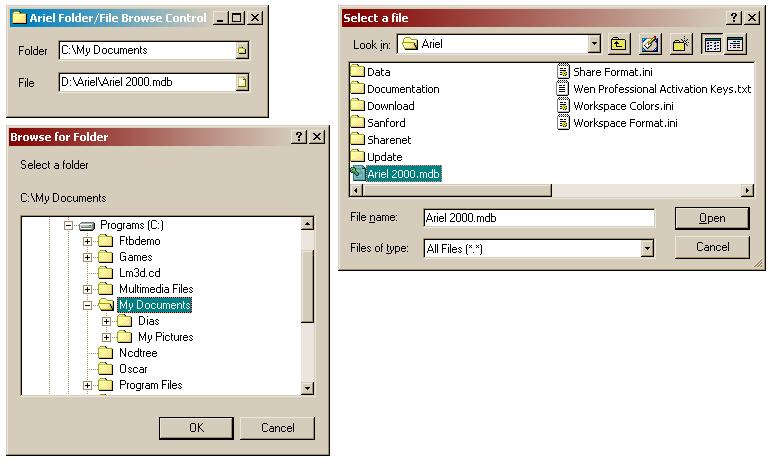

<div align="center">

## Ariel Browse Folder/File Controls V1\.1 \(Update\)


</div>

### Description

Two active-x controls are included in this OCX library, a folder and file selector. The controls resemble a combobox, and when the dropdown button is clicked, a dialog is shown in which a folder or file may be selected. The BrowseFolder control uses the SHBrowseForFolder API function, and the BrowseFile the GetOpenFileName and GetSaveFileName functions. A call back procedure is implemented showing the currently selected folder in the browse for folder dialog. The user has the choice to select any system folder (Desktop, My Computer etc) as the root, or a custom folder. The BrowseFile control returns the filename and path separately from the full path. The standard inverse triangle on the dropdown boxes may be substituted for any 8 pixel wide bitmap (with varying heights), with a choice of mask colors. Full set of events are included, click() upon dialog close, Change() and DropDown() prior to opening of the dialogs. Source also implements BitBlt() API function to copy transparent images. This is an update to the original ArielBrowseFolder Control, which has been removed from PSC.
 
### More Info
 


<span>             |<span>
---                |---
**Submitted On**   |2000-10-03 21:58:46
**By**             |[Tom de Lange](https://github.com/Planet-Source-Code/PSCIndex/blob/master/ByAuthor/tom-de-lange.md)
**Level**          |Intermediate
**User Rating**    |4.6 (23 globes from 5 users)
**Compatibility**  |VB 5\.0, VB 6\.0
**Category**       |[Custom Controls/ Forms/  Menus](https://github.com/Planet-Source-Code/PSCIndex/blob/master/ByCategory/custom-controls-forms-menus__1-4.md)
**World**          |[Visual Basic](https://github.com/Planet-Source-Code/PSCIndex/blob/master/ByWorld/visual-basic.md)
**Archive File**   |[CODE\_UPLOAD104051032000\.zip](https://github.com/Planet-Source-Code/tom-de-lange-ariel-browse-folder-file-controls-v1-1-update__1-11876/archive/master.zip)

### API Declarations

```
No need to copy this!
---------------------------------
FOLDER BROWSE
SHBrowseForFolder Lib "shell32"
SHGetPathFromIDList Lib "shell32"
SHGetFolderLocation Lib "shell32"
SHGetSpecialFolderLocation Lib "shell32"
SHSimpleIDListFromPath Lib "shell32"
FILE BROWSE
GetOpenFileName Lib "comdlg32.dll"
GetSaveFileName Lib "comdlg32.dll"
GRAPHICS
MoveToEx Lib "gdi32"
LineTo Lib "gdi32"
DrawEdge Lib "user32"
PtInRect Lib "user32"
GetClientRect Lib "user32"
BITMAPS
BitBlt Lib "gdi32"
SetBkColor Lib "gdi32"
CreateCompatibleDC Lib "gdi32"
DeleteDC Lib "gdi32"
CreateBitmap Lib "gdi32"
CreateCompatibleBitmap Lib "gdi32"
SelectObject Lib "gdi32"
DeleteObject Lib "gdi32"
GetObject Lib "gdi32"
```


